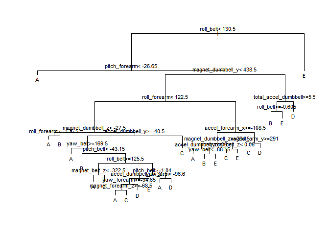
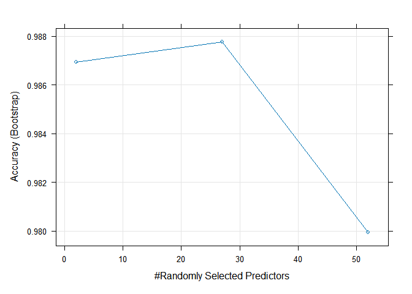
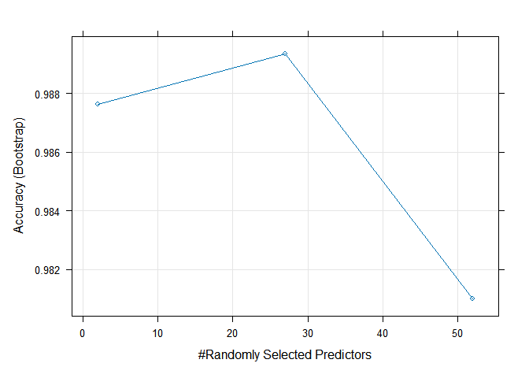
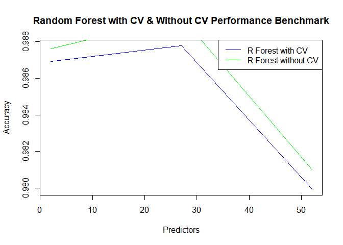

# PRACTICAL MACHINE LEARNING PREDICTION ASSIGNMENT - JHU - COURSERA

This Project is part of JHU - Coursera Project on Practical Machine
Learning. Using devices such as Jawbone Up, Nike FuelBand, and Fitbit it
is now possible to collect a large amount of data about personal
activity relatively inexpensively. These type of devices are part of the
quantified self movement – a group of enthusiasts who take measurements
about themselves regularly to improve their health, to find patterns in
their behavior, or because they are tech geeks. One thing that people
regularly do is quantify how much of a particular activity they do, but
they rarely quantify how well they do it. In this project, your goal
will be to use data from accelerometers on the belt, forearm, arm, and
dumbell of 6 participants.

Data

The training data for this project are available here:
<https://d396qusza40orc.cloudfront.net/predmachlearn/pml-training.csv>

The test data are available here:
<https://d396qusza40orc.cloudfront.net/predmachlearn/pml-testing.csv>

# Required Result

Your submission for the Peer Review portion should consist of a link to
a Github repo with your R markdown and compiled HTML file describing
your analysis. Please constrain the text of the writeup to \< 2000 words
and the number of figures to be less than 5. It will make it easier for
the graders if you submit a repo with a gh-pages branch so the HTML page
can be viewed online (and you always want to make it easy on graders
:-).

# Importing Data and load necessary library

Import data from local directory and consider “NA”,““, and”#DIV/0!” as
NA strings

``` r
library(caret)
```

    ## Loading required package: ggplot2

    ## Loading required package: lattice

``` r
library(tidyverse)
```

    ## ── Attaching core tidyverse packages ──────────────────────── tidyverse 2.0.0 ──
    ## ✔ dplyr     1.1.4     ✔ readr     2.1.5
    ## ✔ forcats   1.0.0     ✔ stringr   1.5.1
    ## ✔ lubridate 1.9.3     ✔ tibble    3.2.1
    ## ✔ purrr     1.0.2     ✔ tidyr     1.3.1

    ## ── Conflicts ────────────────────────────────────────── tidyverse_conflicts() ──
    ## ✖ dplyr::filter() masks stats::filter()
    ## ✖ dplyr::lag()    masks stats::lag()
    ## ✖ purrr::lift()   masks caret::lift()
    ## ℹ Use the conflicted package (<http://conflicted.r-lib.org/>) to force all conflicts to become errors

``` r
library(dplyr)
library(GGally)
```

    ## Registered S3 method overwritten by 'GGally':
    ##   method from   
    ##   +.gg   ggplot2

``` r
library(rpart)
library(randomForest)
```

    ## Warning: package 'randomForest' was built under R version 4.4.2

    ## randomForest 4.7-1.2
    ## Type rfNews() to see new features/changes/bug fixes.
    ## 
    ## Attaching package: 'randomForest'
    ## 
    ## The following object is masked from 'package:dplyr':
    ## 
    ##     combine
    ## 
    ## The following object is masked from 'package:ggplot2':
    ## 
    ##     margin

``` r
# library(cor)
rawdata_training <- read.csv("pml-training.csv",header = TRUE,na.strings = c("NA","","#DIV/0!"))
rawdata_testing <- read.csv("pml-testing.csv",header = TRUE,na.strings = c("NA","","#DIV/0!"))
dim(rawdata_training)
```

    ## [1] 19622   160

``` r
dim(rawdata_testing)
```

    ## [1]  20 160

# Clean Data

By Analyzing the data, we can see many NA strings and we might need to
analyze which variables are not important to the model. Below are my
methodologies to remove unnecessary data 1. Low variability data 2. NA
values will be removed –\> By recognizing sum of NA for each variable,
if sum is 0 then its considered as NA column 3. Remove time variable,
window variable, name and 1st columns

``` r
# Removing NAs
rawdata_training <- rawdata_training[,colSums(is.na(rawdata_training)) == 0]
rawdata_testing <- rawdata_testing[,colSums(is.na(rawdata_testing)) == 0]
dim(rawdata_training)
```

    ## [1] 19622    60

``` r
dim(rawdata_testing)
```

    ## [1] 20 60

``` r
rawdata_training_clean <- rawdata_training[,8:60]
rawdata_testing_clean <- rawdata_testing[,8:60]
```

We will split our training to 70% to generate model & 30% to validate
model to quantify the performance before passing to data testing set

``` r
set.seed(123)
train_sample <- createDataPartition(rawdata_training_clean$classe,p=0.7,list = FALSE)
train <- rawdata_training_clean[train_sample,]
validate <- rawdata_training_clean[-train_sample,]
```

# Data Modelling

## 1. 1st Model, Basic Decision Tree

### 1.1 Decision Tree Model

``` r
model1 <- rpart(classe~.,data = train,method = "class")
par(cex=0.7)
plot(model1)
text(model1)
```



### 1.2 Decision Tree Model Prediction Performance

``` r
predict_validate_tree <- predict(model1,validate,type = "class")
CF_DTree <- confusionMatrix(as.factor(validate$classe),predict_validate_tree)
CF_DTree
```

    ## Confusion Matrix and Statistics
    ## 
    ##           Reference
    ## Prediction    A    B    C    D    E
    ##          A 1552   48   39   24   11
    ##          B  174  588  220   83   74
    ##          C   18   43  888   75    2
    ##          D   60   63  100  651   90
    ##          E    6   64  148   86  778
    ## 
    ## Overall Statistics
    ##                                           
    ##                Accuracy : 0.7573          
    ##                  95% CI : (0.7462, 0.7683)
    ##     No Information Rate : 0.3076          
    ##     P-Value [Acc > NIR] : < 2.2e-16       
    ##                                           
    ##                   Kappa : 0.6926          
    ##                                           
    ##  Mcnemar's Test P-Value : < 2.2e-16       
    ## 
    ## Statistics by Class:
    ## 
    ##                      Class: A Class: B Class: C Class: D Class: E
    ## Sensitivity            0.8575  0.72953   0.6366   0.7084   0.8147
    ## Specificity            0.9701  0.89151   0.9693   0.9370   0.9383
    ## Pos Pred Value         0.9271  0.51624   0.8655   0.6753   0.7190
    ## Neg Pred Value         0.9387  0.95407   0.8957   0.9455   0.9631
    ## Prevalence             0.3076  0.13696   0.2370   0.1562   0.1623
    ## Detection Rate         0.2637  0.09992   0.1509   0.1106   0.1322
    ## Detection Prevalence   0.2845  0.19354   0.1743   0.1638   0.1839
    ## Balanced Accuracy      0.9138  0.81052   0.8029   0.8227   0.8765

## 2. 2nd Model, Random Forest with Cross Validation

### 2.1 Random Forest Model with Cross Validation

``` r
set.seed(321)
model2 <- train(classe~.,data = train,method = "rf", trcontrol = trainControl(method = "cv",10),ntree = 100)
model2
```

    ## Random Forest 
    ## 
    ## 13737 samples
    ##    52 predictor
    ##     5 classes: 'A', 'B', 'C', 'D', 'E' 
    ## 
    ## No pre-processing
    ## Resampling: Bootstrapped (25 reps) 
    ## Summary of sample sizes: 13737, 13737, 13737, 13737, 13737, 13737, ... 
    ## Resampling results across tuning parameters:
    ## 
    ##   mtry  Accuracy   Kappa    
    ##    2    0.9869305  0.9834603
    ##   27    0.9877731  0.9845271
    ##   52    0.9799382  0.9746101
    ## 
    ## Accuracy was used to select the optimal model using the largest value.
    ## The final value used for the model was mtry = 27.

``` r
plot(model2)
```



### 2.2 Random Forest with Cross Validation Prediction Performance

``` r
predict_validate_rforest <- predict(model2,validate)
CF_RFCV <- confusionMatrix(as.factor(validate$classe),predict_validate_rforest)
CF_RFCV
```

    ## Confusion Matrix and Statistics
    ## 
    ##           Reference
    ## Prediction    A    B    C    D    E
    ##          A 1674    0    0    0    0
    ##          B    8 1126    5    0    0
    ##          C    0    5 1017    4    0
    ##          D    0    0   10  954    0
    ##          E    0    0    4    5 1073
    ## 
    ## Overall Statistics
    ##                                          
    ##                Accuracy : 0.993          
    ##                  95% CI : (0.9906, 0.995)
    ##     No Information Rate : 0.2858         
    ##     P-Value [Acc > NIR] : < 2.2e-16      
    ##                                          
    ##                   Kappa : 0.9912         
    ##                                          
    ##  Mcnemar's Test P-Value : NA             
    ## 
    ## Statistics by Class:
    ## 
    ##                      Class: A Class: B Class: C Class: D Class: E
    ## Sensitivity            0.9952   0.9956   0.9817   0.9907   1.0000
    ## Specificity            1.0000   0.9973   0.9981   0.9980   0.9981
    ## Pos Pred Value         1.0000   0.9886   0.9912   0.9896   0.9917
    ## Neg Pred Value         0.9981   0.9989   0.9961   0.9982   1.0000
    ## Prevalence             0.2858   0.1922   0.1760   0.1636   0.1823
    ## Detection Rate         0.2845   0.1913   0.1728   0.1621   0.1823
    ## Detection Prevalence   0.2845   0.1935   0.1743   0.1638   0.1839
    ## Balanced Accuracy      0.9976   0.9964   0.9899   0.9943   0.9991

## 3. 3rd Model, Random Forest without Cross Validation

### 3.1 Random Forest Model without Cross Validation

``` r
set.seed(31)
model3 <- train(classe~.,data = train,method = "rf", ntree = 100)
model3
```

    ## Random Forest 
    ## 
    ## 13737 samples
    ##    52 predictor
    ##     5 classes: 'A', 'B', 'C', 'D', 'E' 
    ## 
    ## No pre-processing
    ## Resampling: Bootstrapped (25 reps) 
    ## Summary of sample sizes: 13737, 13737, 13737, 13737, 13737, 13737, ... 
    ## Resampling results across tuning parameters:
    ## 
    ##   mtry  Accuracy   Kappa    
    ##    2    0.9876212  0.9843417
    ##   27    0.9893441  0.9865233
    ##   52    0.9810035  0.9759734
    ## 
    ## Accuracy was used to select the optimal model using the largest value.
    ## The final value used for the model was mtry = 27.

``` r
plot(model3)
```



### 3.2 Random Forest Prediction Performance

``` r
predict_validate_rforest_noCV <- predict(model3,validate)
CF_RF <- confusionMatrix(as.factor(validate$classe),predict_validate_rforest_noCV)
CF_RF
```

    ## Confusion Matrix and Statistics
    ## 
    ##           Reference
    ## Prediction    A    B    C    D    E
    ##          A 1672    1    0    0    1
    ##          B    7 1123    9    0    0
    ##          C    0    5 1019    2    0
    ##          D    0    0    9  955    0
    ##          E    0    0    4    4 1074
    ## 
    ## Overall Statistics
    ##                                           
    ##                Accuracy : 0.9929          
    ##                  95% CI : (0.9904, 0.9949)
    ##     No Information Rate : 0.2853          
    ##     P-Value [Acc > NIR] : < 2.2e-16       
    ##                                           
    ##                   Kappa : 0.991           
    ##                                           
    ##  Mcnemar's Test P-Value : NA              
    ## 
    ## Statistics by Class:
    ## 
    ##                      Class: A Class: B Class: C Class: D Class: E
    ## Sensitivity            0.9958   0.9947   0.9789   0.9938   0.9991
    ## Specificity            0.9995   0.9966   0.9986   0.9982   0.9983
    ## Pos Pred Value         0.9988   0.9860   0.9932   0.9907   0.9926
    ## Neg Pred Value         0.9983   0.9987   0.9955   0.9988   0.9998
    ## Prevalence             0.2853   0.1918   0.1769   0.1633   0.1827
    ## Detection Rate         0.2841   0.1908   0.1732   0.1623   0.1825
    ## Detection Prevalence   0.2845   0.1935   0.1743   0.1638   0.1839
    ## Balanced Accuracy      0.9977   0.9957   0.9887   0.9960   0.9987

## Performance Benchmark Chart Random Forest with Cross Validation and Without Cross validataion

``` r
plot(model2$results[,1],model2$results[,2],type = "l",col = "blue",xlab = "Predictors",ylab = "Accuracy", main = "Random Forest with CV & Without CV Performance Benchmark")
# lines(model2$results[,1],model2$results[,2],col = "blue",xlab = "Predictors",ylab = "Accuracy", main = "Random Forest with CV & Without CV Performance Benchmark")
lines(model3$results[,1],model3$results[,2],col = "green")
legend("topright", legend = c("R Forest with CV","R Forest without CV"), col = c("blue","green"),lty = 1)
```



# CONCLUSION, Prediction on Test Data

As we can see from model prediction result that Random Forest with Cross
Validation results in best result with 99.3% Model and even Random
Forest without Cross Validation shows good result with 99.28% and lastly
without Random Forest and Cross Validation (Pure Decision Tree) only 75%
model accuracy. This resulting out-of-sample error ~0.0069 for Random
Forest with Cross Validation, ~0.007 for Random Forest without Cross
Validation and 0.24 without Random Forest and Cross Validation.

Hence Random Forest and Cross Validation enhanced model prediction

## 1. Prediction with Test Data Result

``` r
predict1_test <- predict(model1,rawdata_testing_clean[,1:52],type = "class")
predict2_test <- predict(model2,rawdata_testing_clean[,1:52])
predict3_test <- predict(model3,rawdata_testing_clean[,1:52])
print(data.frame("problem" = rawdata_testing_clean$problem_id,"Decision Tree Prediction" = predict1_test,"Random Forest with CV Prediction" = predict2_test, "Random Forest w/o CV" = predict3_test))
```

    ##    problem Decision.Tree.Prediction Random.Forest.with.CV.Prediction
    ## 1        1                        C                                B
    ## 2        2                        A                                A
    ## 3        3                        A                                B
    ## 4        4                        A                                A
    ## 5        5                        A                                A
    ## 6        6                        C                                E
    ## 7        7                        D                                D
    ## 8        8                        A                                B
    ## 9        9                        A                                A
    ## 10      10                        A                                A
    ## 11      11                        C                                B
    ## 12      12                        C                                C
    ## 13      13                        B                                B
    ## 14      14                        A                                A
    ## 15      15                        C                                E
    ## 16      16                        E                                E
    ## 17      17                        A                                A
    ## 18      18                        B                                B
    ## 19      19                        B                                B
    ## 20      20                        B                                B
    ##    Random.Forest.w.o.CV
    ## 1                     B
    ## 2                     A
    ## 3                     B
    ## 4                     A
    ## 5                     A
    ## 6                     E
    ## 7                     D
    ## 8                     B
    ## 9                     A
    ## 10                    A
    ## 11                    B
    ## 12                    C
    ## 13                    B
    ## 14                    A
    ## 15                    E
    ## 16                    E
    ## 17                    A
    ## 18                    B
    ## 19                    B
    ## 20                    B

## 2. Model Accuracy Benchmark

``` r
print(data.frame("Decision Tree" = CF_DTree$overall[1], "Random Forest with CV" = CF_RFCV$overall[1],"Random Forest w/o CV" = CF_RF$overall[1]))
```

    ##          Decision.Tree Random.Forest.with.CV Random.Forest.w.o.CV
    ## Accuracy     0.7573492             0.9930331            0.9928632
